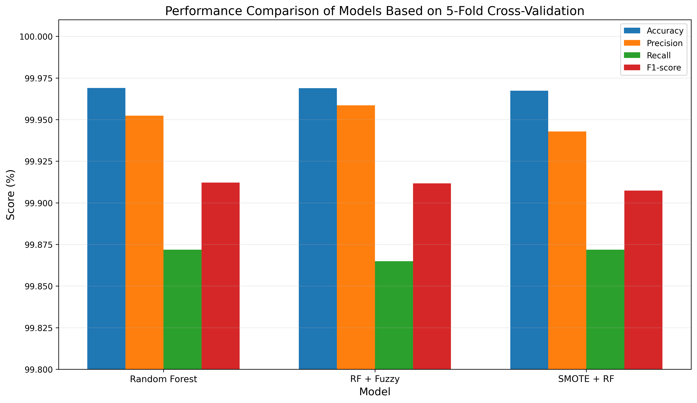

# CICIDS2017-DDoS-Hybrid-IDS
# A Hybrid Random Forest and Fuzzy Logic Based IDS for DDoS Detection
This repository contains the implementation of a hybrid

intrusion detection system based on Random Forest and
Fuzzy Logic for DDoS attack detection using the CICIDS2017 dataset.

CICIDS2017
     ↓
Preprocessing
     ↓
Feature Selection
     ↓
Random Forest
     ↓
Attack Probability
     ↓
Fuzzy Inference
     ↓
Score Fusion
     ↓
Final DDoS Decision

1. Random Forest
2. RF + Fuzzy
3. SMOTE + Random Forest
4. 5-Fold Stratified Cross-Validation

Metrics:
- Accuracy
- Precision
- Recall
- F1-Score
- False Positive Rate

| Model         | Accuracy | Precision |   Recall |       F1 |           FPR |
| ------------- | -------: | --------: | -------: | -------: | ------------: |
| Random Forest | 99.9690% |  99.9523% | 99.8719% | 99.9121% |     0.010206% |
| RF + Fuzzy    | 99.9689% |  99.9586% | 99.8649% | 99.9117% | **0.008868%** |
| SMOTE + RF    | 99.9673% |  99.9429% | 99.8719% | 99.9074% |     0.012200% |

## Performance Comparison

